<div align="center">

<picture>
  <source media="(prefers-color-scheme: dark)" srcset="docs/banner-dark.svg">
  
</picture>

**A portfolio built as an observatory: every section is a working instrument, not a description of one.**

[](https://lalsm.vercel.app)
[](https://nextjs.org)
[](https://react.dev)
[](https://www.typescriptlang.org)
[](#creative-playground-and-the-nebula-seams)

[](#checked-not-claimed)
[](#checked-not-claimed)
[](#a-cv-that-is-easy-to-find)
[](#license)

[**Open the site**](https://lalsm.vercel.app) · [Tour](#a-tour-of-the-instruments) · [Run it](#run-it) · [How it stays smooth](#how-it-stays-smooth) · [Ringkasan Bahasa Indonesia](#ringkasan-singkat-bahasa-indonesia)

</div>

<br>

<picture>
  <source media="(prefers-color-scheme: dark)" srcset="docs/screenshots/hero-dark.jpg">
  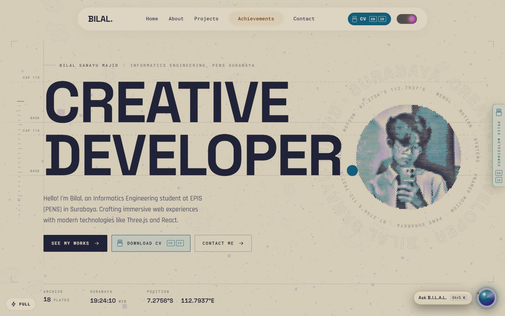
</picture>

<p align="center"><sub>The hero, in the theme your system prefers. The same page has a night-sky theme and a printed-star-atlas theme, and the switch between them is a circle that spreads from the toggle.</sub></p>

<div align="center"></div>

## The idea

Most portfolios say *"I care about performance and motion."* This one tries to **be the evidence**.

The page is an observatory. Each section is an instrument with a job, and every ornament on it encodes something real: the coordinates in the corner are Surabaya's, the clock in the headline tells Surabaya's time, the bars beside a tool are how many of the archive's projects use it, the status light on the assistant says whether a live model is behind it, and the number of thumbnails on a CV card is the number of entries on that CV. If a detail cannot be backed by data, it does not go in.

The second rule is a **frame budget**. Nothing on the page is allowed to cost frames to look good: effects get cheaper on a struggling device instead of disappearing, per-frame values never go through React state or CSS transitions, and the heavy things are prepared behind a splash screen so that arriving at a section is an animation, not a stall.

<div align="center"></div>

## A tour of the instruments

### First light: the splash

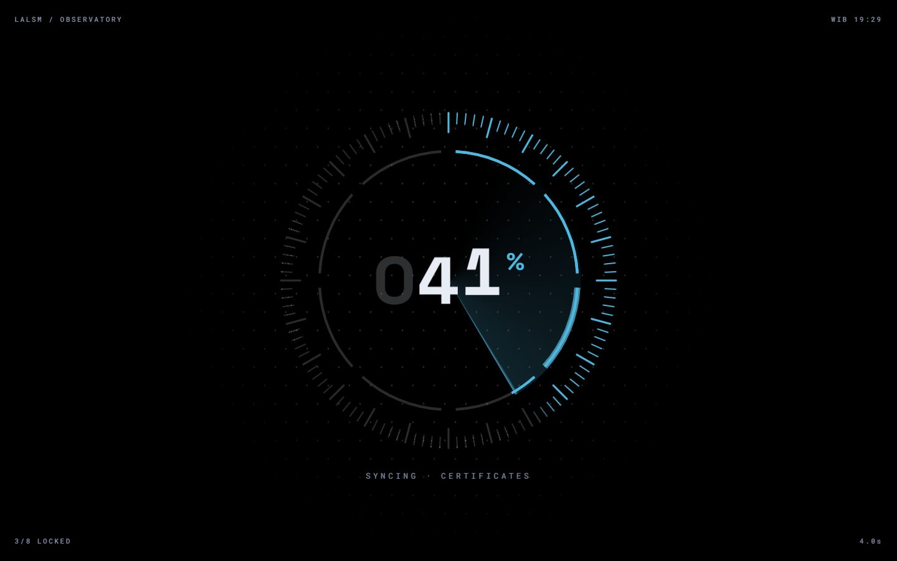

The splash is **server-rendered**, so it covers the page from the first pixel, before any script has run. That fixes a common loader bug: the hero showing for a moment before the loader starts. A controller then writes *real* numbers into it. The dial's eight arcs are the eight systems being warmed up (the portrait's dots, fonts, the code of every lazily mounted section, the certificates, the shared WebGL context and shaders, a first draw of each nebula seam, the tubes' first frame, the project plates), weighted by what each costs. It opens along the horizon in two halves, using transforms only.

### The hero, and the clock in the O

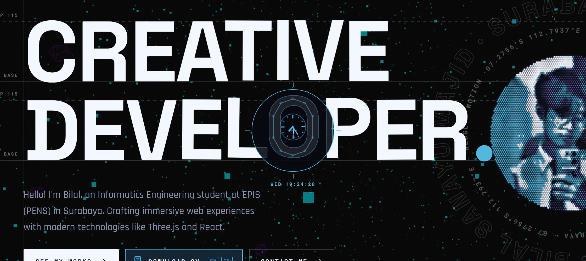

A lens follows the pointer and shows each letter's **skeleton as a constellation**. Over the **O**, the skeleton becomes the bezel of a wall clock: the ring locks on, twelve ticks draw themselves, the hands swing to the real time in Surabaya and the second hand sweeps from where the real one is. The readout changes from coordinates to `WIB hh:mm:ss`. It is all CSS transforms; the pointer loop only toggles one attribute and writes three numbers. Reduced motion gets the hands at the right time and nothing sweeping. (The O in the banner above is a nod to it.)

### What I Build: an exploded view

<table>
<tr>
<td width="50%">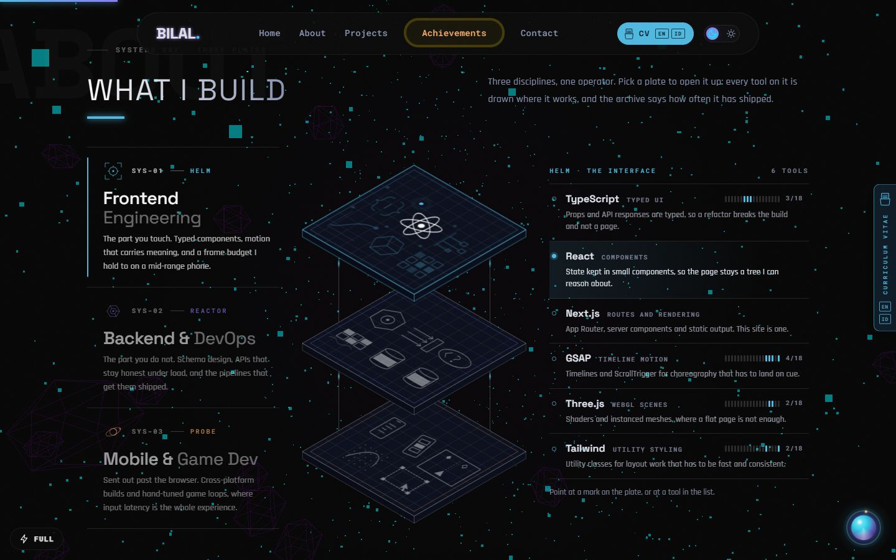</td>
<td width="50%">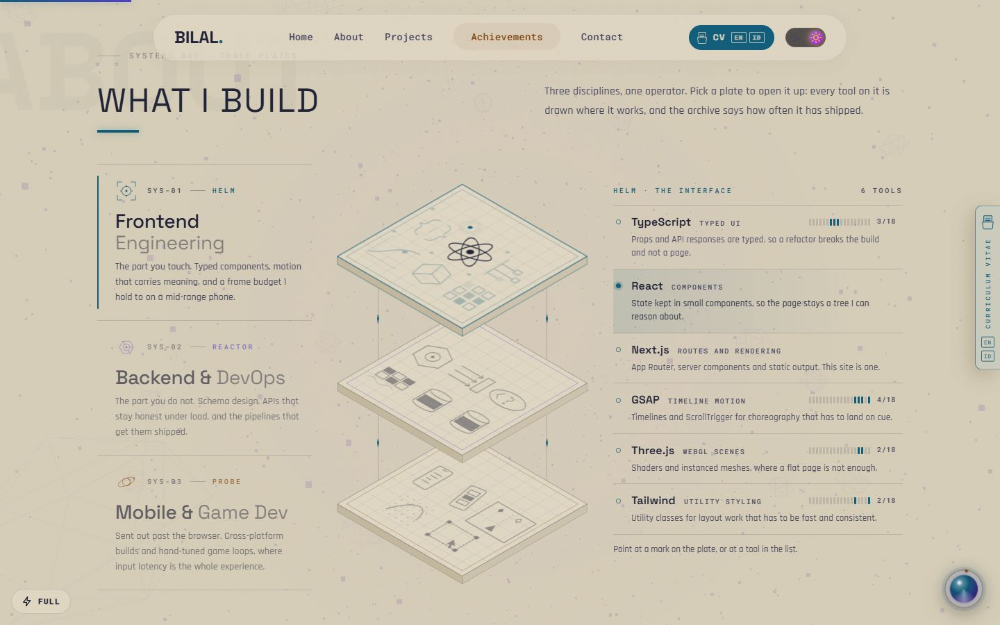</td>
</tr>
</table>

Three plates, one per discipline (frontend, backend and devops, mobile and game), drawn isometrically from one SVG matrix and tied by wires. Pick one and it rises while the plates above it open upward to uncover it. Each tool of a discipline is a small drawing on the plate, and the legend says what the tool is for and **how many projects of the public archive use it**: a real count from `data/projects.ts`. Pointing at a tool lights its drawing and the other way round; left alone, it steps through the tools. The plates carry no text, and only the open plate moves by itself, only on screen, and only on a device that is not struggling.

### How I Work: the flight deck

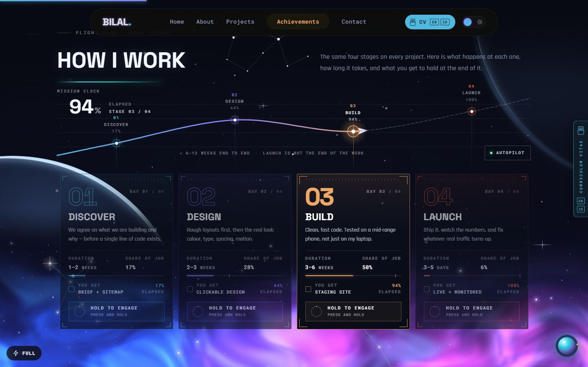

Four stages on a route map. **Scroll flies the ship**, drag the map to scrub, hold a bay's button to engage it. Built on Motion with springs and an odometer; on a phone the bays become a swipe rail.

### Creative Playground and the nebula seams

The only pinned section: a horizontal run (GSAP ScrollTrigger on Lenis) through an observation deck over a tube-cursor WebGL background, then the career pathway. The glow that joins two sections is two canvases (one in each section) painted by **one shared renderer** from one world-space field, so the halves meet by construction. The cloud is redrawn about a dozen times a second (its drift needs no more) and **the pointer's push on it is applied in the cheap final pass instead**, so while the pointer moves over a seam only that pass runs, at up to 60 frames a second.

### Projects: the observatory plates

<table>
<tr>
<td width="50%">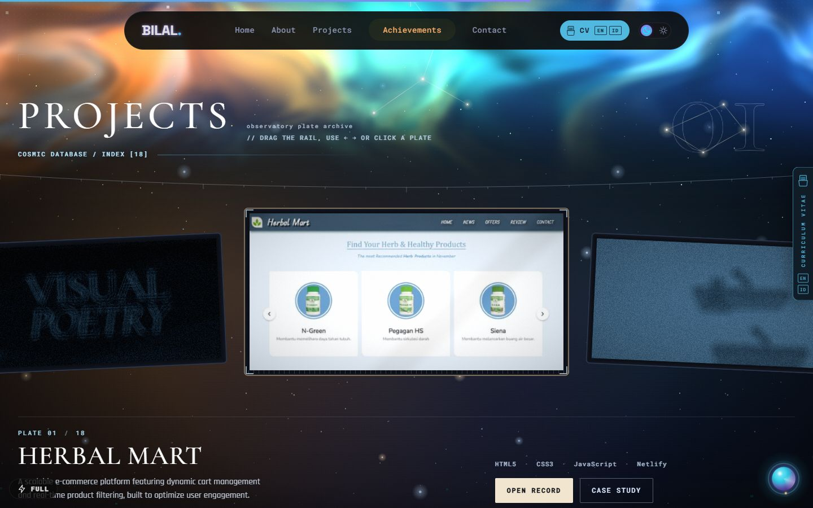</td>
<td width="50%">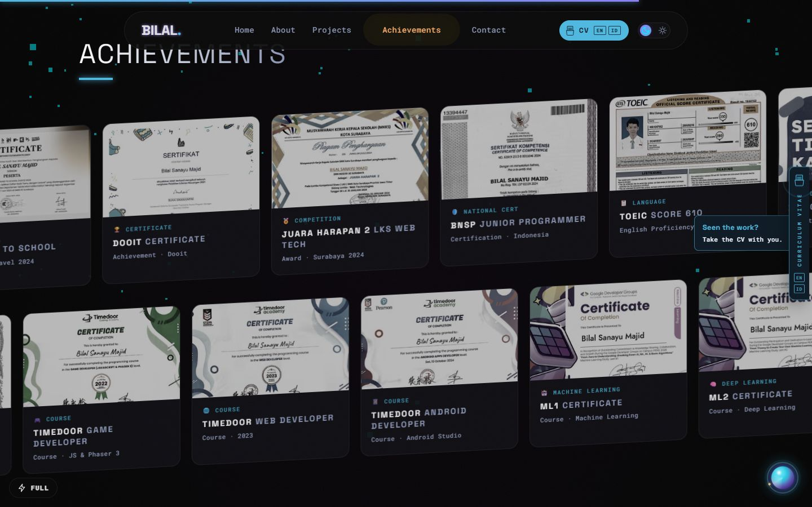</td>
</tr>
</table>

Eighteen projects as a carousel of plates, **drawn in one draw call** from a texture atlas, warmed behind the splash. Every project also has a static case-study page, so nothing depends on WebGL to be read. Beside it, a kinetic marquee of the thirteen certificates and awards; each opens to the certificate itself.

### A CV that is easy to find

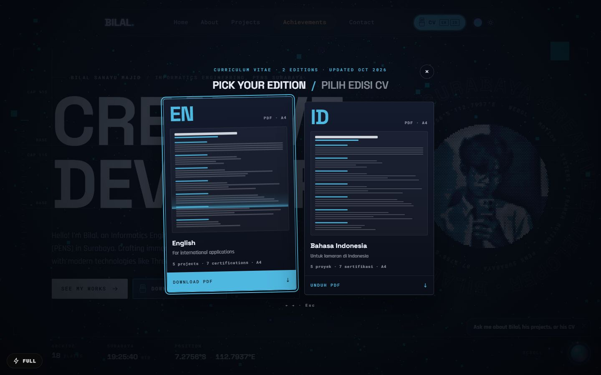

The CV exists in **English and Indonesian**, as pages (`/cv`, `/cv/id`) and as PDFs (`/cv.pdf`, `/cv-id.pdf`), all generated from one file, `data/cv.ts`, so the two languages and the two formats cannot drift apart. The PDF is generated on the server with `pdf-lib`: one column, real text, clickable links, two pages, readable by people and by applicant-tracking software.

Recruiters should not have to hunt for it, so there are five handles, all opening the *same* chooser: a pill in the nav bar (on phones too), a third button in the hero, a tab on the right edge that follows you down the page, a row in Contact, and the card on the career slide. Each edition's card carries a thumbnail drawn from that CV's real sections and entries, and the one you pick is stamped as it downloads. The edge tab speaks once per visit, when the achievements come into view.

### B.I.L.A.L., the assistant

<table>
<tr>
<td width="50%">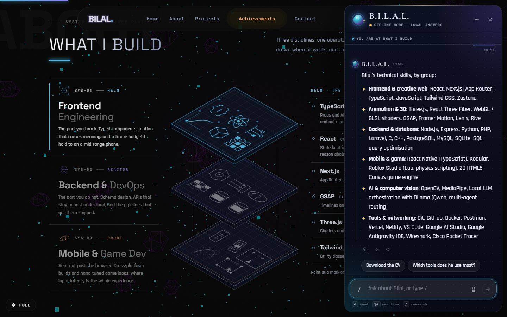</td>
<td width="50%">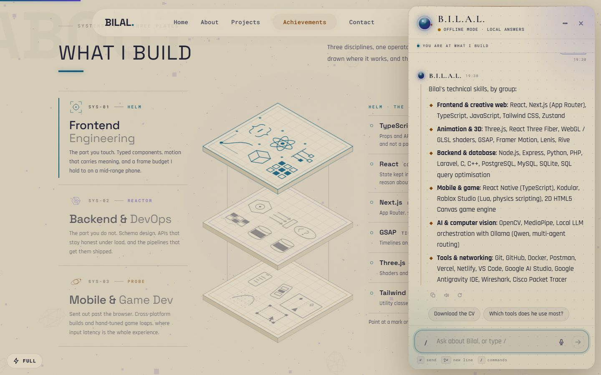</td>
</tr>
</table>

*Brain & Intelligent Logic Assistant Link.* A launcher (or <kbd>Ctrl</kbd> <kbd>K</kbd>) opens a panel that **floats** at the right edge and does not push the page: the page stays put and the assistant can point at it.

- **Knows where you are.** It watches which section is under the middle of the window and sends that with your question, so "what is this?" has an answer, and it offers questions that fit the section.
- **Honest about what it is.** It answers from Gemini when a key is configured and from offline rules when not, and the status light says which (asked of the server, never guessed).
- **Markdown that cannot hurt.** Replies render as elements built from a small parser; there is no HTML anywhere in it, and a link is kept only if it is http(s), mailto, an anchor or a path on this site. Code has a copy button.
- **Cards, not just words.** What a reply points at (a project, a certificate, the CV chooser) appears as a card built from the real archive, never from the model's words.
- **Slash commands** that run instantly, without the model: `/projects` `/skills` `/certificates` `/cv` `/contact` `/tour` `/theme` `/tone` `/export` `/clear` `/help`.
- **A scripted tour**, a **tone** setting (default, casual, sensei), **Indonesian and English**, **speech in and out** where the browser has it, **Stop** and **Answer again**, export as markdown, or send the conversation to Bilal through the contact form.

<table>
<tr>
<td width="34%">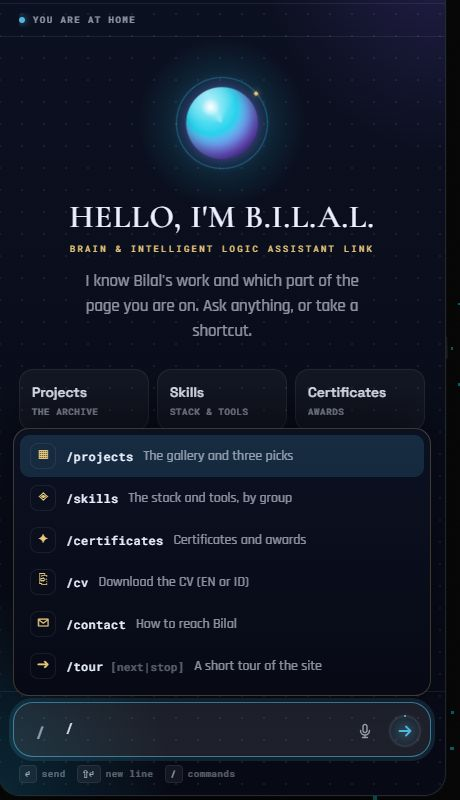</td>
<td width="33%">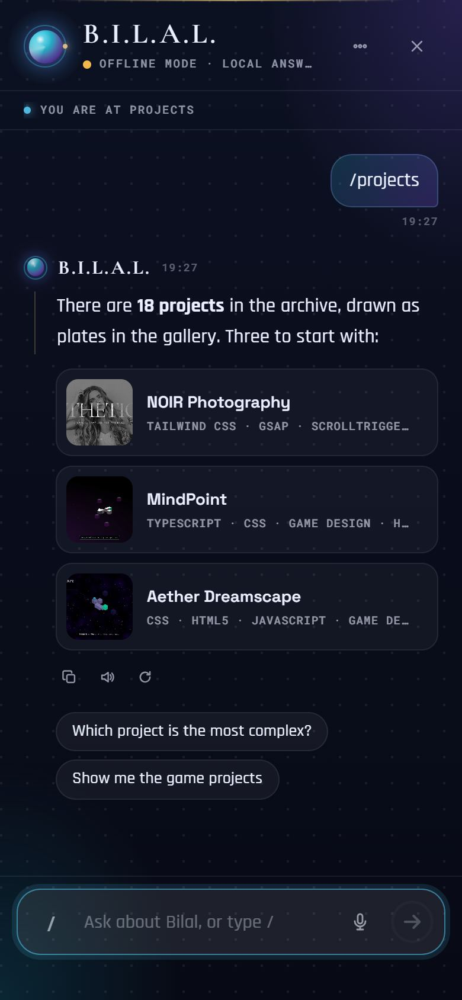</td>
<td width="33%">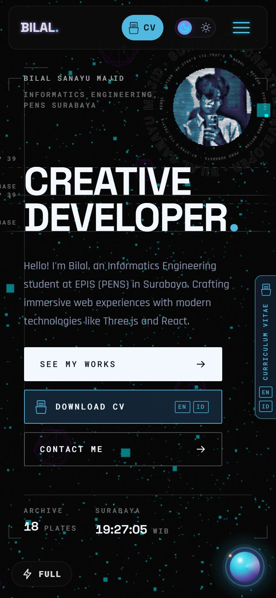</td>
</tr>
</table>

<div align="center"></div>

## Two media, one sky

The dark theme is the night sky: light added to black. The light theme is the same sky as a **printed star atlas**: ink on paper, from the hero to the footer, and nothing stays black. There is no white in it. The lightest surface is a warm paper, text is indigo ink, and every accent used as text is a pigment that clears 4.5:1 on the paper.

- The nebula and the stars have a **paper mode** in the shader: the same field is read as pigment, with density as opacity, and stars become specks of ink. On paper the tubes canvas is inverted and multiplied onto the page.
- **The paper follows the sun over Surabaya.** Noon is the stylesheet's paper; toward the horizon it warms; after dark it is dimmed a few percent and warmed further, like a sheet under a lamp. Never lighter than noon.
- **Switching theme** spreads the new theme from the toggle as a circle (View Transitions API). While it happens every CSS transition is switched off: the page's 0.4 s colour fades are for hovers, and during the switch they made thousands of elements repaint for a colour the picture already showed.

## How it stays smooth

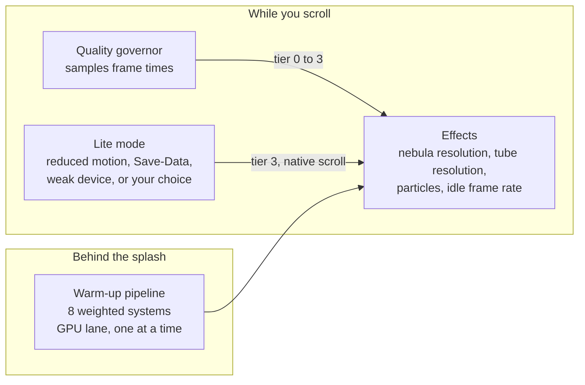

- **Quality governor.** One rAF sampler watches frame times and publishes a tier 0 to 3 as `<html data-q>`. Effects read it and get cheaper, never absent.
- **Warm-up behind the splash.** Eight systems are prepared while it is up. The heavy ones run one at a time with a frame between, so the screen in front keeps painting.
- **One WebGL context** for every nebula seam and one draw call for the project plates, instead of a context per canvas.
- **No scroll-jacking beyond the one pin.** ScrollTrigger snapping is deliberately off, because it fights Lenis.
- **Lite mode** is decided before first paint. It drops the starfield, the tube cursor, the seam animation and backdrop blur, and uses native scrolling.
- **Per-frame values** (anything driven by scroll, pointer or a loop) are written to leaf elements through motion values or refs, never CSS transitions and never React state.

### Checked, not claimed

Numbers from this project's own measurements: headless Chrome on the author's machine, frames recorded with `requestAnimationFrame`, old and new builds compared in the same sitting. They are for comparing runs on the same machine, not for reading as absolute GPU numbers.

| What was wrong | Before | After |
| --- | --- | --- |
| Switching theme: frames in the first 1.5 s (hero) | 14 to 17, with stalls of 400 to 480 ms | about 145 to 151, worst frame about 100 ms (the capture before the reveal) |
| Nebula under the pointer: repaints per second while hovering a seam | about 35 | about 118 (gap between repaints, p95: 91 ms to 26 ms) |
| Assistant panel opening: frames in 1.2 s | n/a | 144, worst frame 21 ms; page frame time with the panel open is the same as without |

<details>
<summary><strong>The test suites</strong></summary>

<br>

**278 unit tests** (Vitest) cover the pure logic: the isometric geometry, the flight deck, the warm-up pipeline, the splash, the lens, the quality governor, the CV and its PDF, the assistant's markdown, commands, cards, prompt and request validation.

**148 end-to-end tests** (Playwright, against a production build) cover the sections, seams at fractional pixel ratios, Lite, reduced motion, phones and keyboard. They include tests that would catch the things that go wrong quietly: that the splash is not left over a secondary page, that nothing transitions during a theme switch, that a reply cannot inject markup or a script link, that the CV handles all open the one chooser and give the focus back.

```bash
npm run check        # lint + typecheck + unit tests
npm run build && npm run test:e2e     # add --workers=1 on a loaded machine
npm run perf         # frame times per section on a CPU-throttled Chrome
```

</details>

<div align="center"></div>

## Run it

Node 20.9 or newer, and npm.

```bash
git clone https://github.com/Lal1602/lalsm.git
cd lalsm
npm install
cp .env.example .env      # every variable is optional
npm run dev               # http://localhost:3000
```

Without `GEMINI_API_KEY` the assistant still works, answering from its offline rules (and says so).

```bash
npm run build && npm run start      # production
```

| Variable | What it does |
| --- | --- |
| `GEMINI_API_KEY` | Turns on the live model for the assistant. Optional. |
| `GEMINI_MODELS` | Comma-separated models tried in order. |
| `UPSTASH_REDIS_REST_URL`, `UPSTASH_REDIS_REST_TOKEN` | Share the assistant's rate-limit counters across serverless instances. |
| `NEXT_PUBLIC_SITE_URL` | The real origin, used by canonical URLs, the sitemap, robots, Open Graph and JSON-LD. Set it before building. |
| `NEXT_PUBLIC_WEB3FORMS_KEY` | The contact form's access key (public by design; restrict it to your domain). |
| `NEXT_PUBLIC_ANALYTICS_PROVIDER` | `plausible`, `umami` or `vercel`. Off by default. |

> **Heads up for contributors:** this is Next.js 16, with breaking changes from the Next.js most people know. Read the relevant guide in `node_modules/next/dist/docs/` before changing routing, caching or metadata code.

## What is in the box

| Layer | Technologies |
| --- | --- |
| Framework | Next.js 16 (App Router), React 19, TypeScript 5 |
| Motion | Motion (`LazyMotion`), GSAP with ScrollTrigger, Lenis |
| WebGL | Three.js (starfield, tube cursor), and raw-WebGL renderers written for the nebula seams and the project plates |
| Styling | One flat cascade in `app/styles/*.css` (order matters), Tailwind v4 for resets |
| AI | `@google/genai`, NDJSON streaming, per-IP rate limit (6 a minute, 40 an hour; optionally Upstash Redis) |
| Content | Typed `data/*.ts`, MDX blog, `pdf-lib` for the generated CV |
| State | Zustand |
| Tests | Vitest, Playwright |

<details>
<summary><strong>Project structure</strong></summary>

```
app/
  page.tsx, layout.tsx         Home page and root layout (the boot scripts live here)
  styles/                      The stylesheet, split by section. Numeric prefixes set the cascade order.
  api/ai/chat/                 The assistant's streaming endpoint (POST) and its status (GET)
  projects/, blog/, cv/        Case studies, MDX blog, the CV (/cv, /cv/id)
  cv.pdf/, cv-id.pdf/          The CV as PDF, in English and Indonesian
components/
  ui/                          Sections and effects
  ui/hero/ hiw/ wb/ chat/      Hero, How I Work, What I Build, the assistant's parts
lib/
  space/, plates/              The two WebGL renderers (shaders, layout, atlas)
  chat/                        The assistant's pure logic: markdown, commands, cards, copy, context, tour, prompt
  cv/, flight/, build/, hero/  CV and PDF, flight deck, isometric geometry, the clock: pure and unit-tested
  quality*.ts, warmup*.ts      Quality governor and the warm-up pipeline
data/                          projects.ts, achievements.ts, profile.ts, cv.ts: the single source of truth
content/blog/                  MDX posts
stores/                        Zustand stores (theme, chat)
tests/                         unit, e2e, perf
docs/                          Banner, screenshots, and ENGINEERING.md (the long-form notes)
```

</details>

## House rules

These are in the code's habits, and a pull request is held to them.

1. **Every ornament encodes data.** If a detail cannot be backed by something real, it is not there.
2. **Styles are one flat cascade.** Generic class names silently lose on source order, so every section has its own prefix (`hx-`, `wb-`, `fd-`, `plate-`, `seam-`, `cvd-`, `ai-`, `pl-`).
3. **Per-frame values never touch React state or CSS transitions.** They go to leaf elements through motion values or refs.
4. **Effects get cheaper, never absent.** A tier lowers resolution and counts; Lite and reduced motion keep every function and drop the motion.
5. **Hydration:** anything that reads a browser preference uses `useSyncExternalStore` with a server snapshot.
6. **Content lives in `data/`.** Add a project once and it appears in the plates, the case-study pages, the sitemap and the assistant's knowledge. The CV is its own file, with every line in two languages.
7. **Report performance honestly:** measure old against new in the same sitting, and say what the machine was.

Much more detail, section by section, is in [`docs/ENGINEERING.md`](docs/ENGINEERING.md).

<div align="center"></div>

## Things to try

<details>
<summary><strong>Small things that are easy to miss</strong></summary>

<br>

- Hover the **O** of DEVELOPER in the hero.
- Press <kbd>Ctrl</kbd> <kbd>K</kbd> anywhere, type `/`, and run `/tour`.
- In *What I Build*, point at a tool and watch its drawing light up on the plate, and the other way round.
- In *How I Work*, drag the route map, then hold a bay's button until the ring completes.
- Move the pointer slowly across a nebula seam.
- Switch the theme and watch where the circle starts.
- In the light theme, open the site at midday and again after dark: the paper is not the same.
- Ask the assistant for the CV, or press `/cv`.
- Turn on reduced motion in your system settings, or flip *Lite* in the bottom-left corner: everything still works, nothing moves by itself.

</details>

## Ringkasan singkat (Bahasa Indonesia)

<details>
<summary><strong>Buka ringkasan</strong></summary>

<br>

Ini kode situs portofolio **Bilal Sanayu Majid**, mahasiswa D3 Teknik Informatika PENS Surabaya. Situsnya dibuat sebagai sebuah *observatorium*: tiap bagian adalah instrumen yang bekerja, bukan deskripsi tentang instrumen.

- **Aturan pertama:** setiap hiasan harus membawa data yang nyata (koordinat itu koordinat Surabaya, jam di huruf O itu jam Surabaya, batang di samping tool adalah jumlah proyek di arsip yang memakainya).
- **Aturan kedua:** anggaran frame. Efek boleh menjadi lebih murah di perangkat yang kesulitan, tapi tidak dihilangkan, dan hal-hal berat disiapkan di balik splash screen.
- **Bisa dicoba:** hover huruf **O** pada judul, tekan `Ctrl K` untuk membuka asisten B.I.L.A.L. lalu ketik `/tour`, ganti tema dan lihat lingkaran yang menyebar dari tombolnya.
- **CV** tersedia dalam bahasa Indonesia dan Inggris (`/cv`, `/cv/id`, serta PDF-nya), dibuat dari satu berkas data.
- **Menjalankan:** `npm install`, salin `.env.example` menjadi `.env` (semua variabel opsional), lalu `npm run dev`. Tanpa `GEMINI_API_KEY` asisten tetap berjalan dari aturan offline dan mengatakannya dengan jujur.

</details>

<div align="center"></div>

## Author

**Bilal Sanayu Majid** · Creative Developer & Full Stack Web Developer · Informatics Engineering, [PENS](https://www.pens.ac.id) Surabaya

[Website](https://lalsm.vercel.app) · [GitHub @Lal1602](https://github.com/Lal1602) · [CV in English](https://lalsm.vercel.app/cv) · [CV dalam Bahasa Indonesia](https://lalsm.vercel.app/cv/id)

To hire or collaborate, use the Uplink form in the site's Contact section, or ask the assistant.

## License

MIT. Explore, learn, and take what is useful.

<div align="center">
<sub>Built in Surabaya · 7.2756°S 112.7937°E</sub>
</div>
